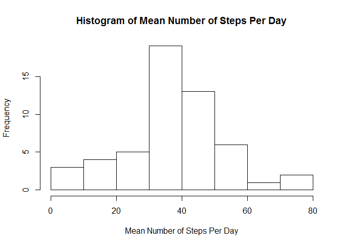
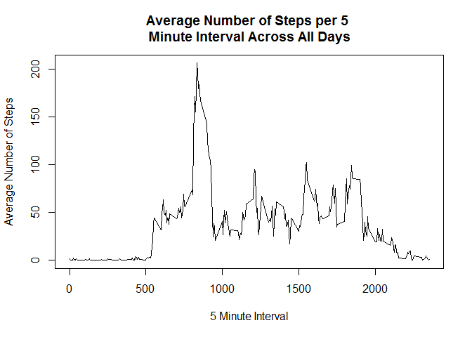
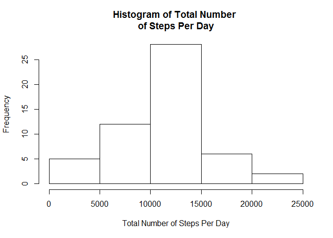
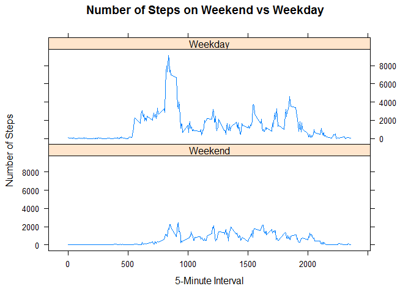

# Week 2 Project
Billy Caughey  
February 2, 2017  


## Loading and preprocessing the data
In this step of the project, all the importing of data and preprocessing required will be done.

We begin by reading in the data. A simple "read.csv" command is sufficient for this project.

```r
## Read in data
proj2 <- read.csv("activity.csv",
                  stringsAsFactors = FALSE)
```

It is important to familiarize ourselves with the data. Let's use the 'head' command to see what the first few rows look like.


```r
head(proj2)
```

```
##   steps       date interval
## 1    NA 2012-10-01        0
## 2    NA 2012-10-01        5
## 3    NA 2012-10-01       10
## 4    NA 2012-10-01       15
## 5    NA 2012-10-01       20
## 6    NA 2012-10-01       25
```

## What is the mean number of steps taken per day?
In this section, we need to collapse the data set down to the day. This collapse will be the mean number of steps taken each day. We do this by using the "aggregate" command.


```r
proj2_collapsed <- aggregate(steps ~ date, data = proj2, FUN = mean, na.rm = TRUE)
```

Now that we have the data, we need an appropriate way to display the findings. It would be inappropriate to print the list of 53 days and their averages. Instead, we are going to use the 'hist' command to produce a histogram for a visual representation.


```r
hist(proj2_collapsed$steps,
     main = "Histogram of Mean Number of Steps Per Day",
     xlab = "Mean Number of Steps Per Day")
```

<!-- -->

The distribution is 'roughly' normal at first glance. For kickers, we use the 'summary' command to discover the mean and median of the mean number of steps per day.


```r
summary(proj2_collapsed$steps)
```

```
##    Min. 1st Qu.  Median    Mean 3rd Qu.    Max. 
##  0.1424 30.7000 37.3800 37.3800 46.1600 73.5900
```

The mean and median are both 37.3800 steps per day. 
k
## What is the daily activity pattern?

In this section we are concerned with finding the most active five minute interval across all days. We will do this by finding the average number of steps in a 5 minute window across all days. Again, the 'aggregate' command will do the trick for us.


```r
proj2_interval <- aggregate(steps ~ interval, data = proj2, FUN = mean, na.rm = TRUE)
plot(proj2_interval$interval, proj2_interval$steps,type = "l",
     main = "Average Number of Steps per 5 \nMinute Interval Across All Days",
     xlab = "5 Minute Interval",
     ylab = "Average Number of Steps")
```

<!-- -->

The maximnum number of steps taken occurs at interval 835.

## Imputing Missing Values

This data set, proj2, has a lot of missing values in the steps field.


```r
table(is.na(proj2$steps))
```

```
## 
## FALSE  TRUE 
## 15264  2304
```

There are 2,304 missing values in the steps field. In this section, we are going to devise a method to impute those values. Simple methods include letting missing values be the mean or the median of the data. More complex values allow the user to get into the weeds a bit by developing a model.

Since the method selected does not need to be a complex method, we will use the mean steps in a five minute interval to replace the NAs in the steps field. Recall, earlier a data set, 'proj2_interval', was created. This data set had the mean number of steps per 5 minute interval. We merge in the data and have the data ready for substitution in the case of an NA.


```r
# Merge in proj2_collapsed
proj2_imp <- merge(proj2, proj2_collapsed, by.x = "date", by.y = "date")
        names(proj2_imp)[2] <- "steps"
        names(proj2_imp)[4] <- "average.steps"
        head(proj2_imp)
```

```
##         date steps interval average.steps
## 1 2012-10-02     0     1740        0.4375
## 2 2012-10-02     0     1715        0.4375
## 3 2012-10-02     0     1725        0.4375
## 4 2012-10-02     0     1710        0.4375
## 5 2012-10-02     0     1735        0.4375
## 6 2012-10-02     0     1855        0.4375
```

There are several ways to make the substitution, such as mutate. In the interest of ease, let's use the 'ifelse' command to make the substitution.


```r
# Replace values
proj2_imp$steps <- ifelse(is.na(proj2_imp$steps) == TRUE, proj2_imp$average.steps,
                         proj2_imp$steps)
```

Now, we compute the total number of steps each day and produce another histogram.


```r
## Collapse to the total number of steps taken each day and then produce a histogram
proj2_sum <- aggregate(steps ~ date, data = proj2_imp, FUN = sum, na.rm = TRUE)

hist(proj2_sum$steps,
     main = "Histogram of Total Number \nof Steps Per Day",
     xlab = "Total Number of Steps Per Day")
```

<!-- -->

```r
summary(proj2_sum$steps)
```

```
##    Min. 1st Qu.  Median    Mean 3rd Qu.    Max. 
##      41    8841   10760   10770   13290   21190
```

The curve appears normal so we can expect the median and the mean to be close. After using the summary command, we see the median and mean are close.

## Are there differences in activity patterns between weekdays and weekends?

Finally, we are concerned with finding a difference between weekdays and weekends. We will use the "proj2_imp" dataset along with the 'weekdays' command. This will allow us to identify the weekdays and the weekends in the data set. To make things interesting, I created a function called 'is.Weekday'. If the day is a weekend, the new filed of weekday will be a 1, otherwise a 0. The field will be of type factor with the labels of "weekend" and "weekday".


```r
# Simple function to go over 
is.Weekday <- function(x){
        x1 <- weekdays(as.Date(x))
        y1 <- 0
        # If a weekday, change to 1
        if(x1 %in% c("Monday","Tuesday","Wednesday","Thursday","Friday")){
                y1 <- 1
        }
        return(y1)
}

proj2_imp$weekday <- factor(sapply(X = proj2_imp$date,FUN = is.Weekday),
                            labels = c("Weekend","Weekday"))
```

Now we collapse the dataset by the fields of weekend and weekday using the functions 'aggregate' and 'sum'.


```r
proj2_imp1 <- aggregate.data.frame(x = proj2_imp$steps,
                                   by = list(proj2_imp$interval,proj2_imp$weekday),
                                   FUN = sum,
                                   na.rm = TRUE)
```


Finally, using the lattice package, we plot the intervals.


```r
library(lattice)
xyplot(x ~ Group.1 | Group.2, data = proj2_imp1,
       layout = c(1,2),type="l",xlab = "5-Minute Interval",
       ylab = "Number of Steps",main="Number of Steps on Weekend vs Weekday")
```

<!-- -->

From the plots, we can see the number of steps on the weekday are greater than the weekend. And who could blame our sample? The weekends are a good time to be lazy right?!

